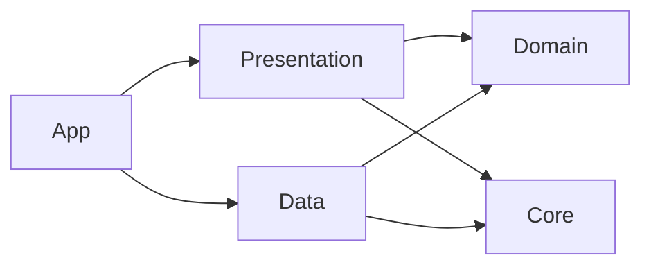

# Momentum

[](https://github.com/obadasemary/Momentum/actions/workflows/CI.yml)

A multi-platform SwiftUI application built with Swift 6.2, Clean Architecture, and a fully modular Swift Package Manager structure.

## Requirements

- Xcode 16+
- Swift 6.2
- iOS 26.2+ / macOS 26.1+ / visionOS 26.2+

## Setup Instructions

```bash
git clone https://github.com/obadasemary/Momentum.git
open Momentum.xcworkspace
```

Select the **Momentum** scheme, choose a simulator, and press **Run**. No `pod install` or other setup needed.

## Architecture Overview

The project is split into four independent Swift packages under `Packages/`, wired together in the app layer. Dependencies only point inward:



| Package | Responsibility |
|---|---|
| **Core** | `NetworkClientProtocol`, `URLSessionNetworkClient`, `ImageCache` (actor-backed) |
| **Domain** | Value-type entities, repository protocols, use cases — zero UI or network imports |
| **Data** | DTOs, mappers, `CharacterDataRepository`, `ToDoDataRepository` (SwiftData), `CharacterEndpoint` |
| **Presentation** | SwiftUI views, `@Observable` ViewModels, Builders — depends on Domain and Core only |
| **App (Momentum target)** | `AppDependencyContainer`, composition root, `MomentumApp`, `ContentView` |

### Key Patterns

- **Builder pattern** — `FeedBuilder` and `ToDoBuilder` accept use-case protocols and produce fully-wired views
- **Repository pattern** — Domain defines protocols; Data implements them
- **Unidirectional data flow** — View → ViewModel → UseCase → Repository → Network/DB
- **State machine ViewModels** — enum `State { idle | loading | loaded | error }` makes impossible states impossible
- **`@Observable`** — replaces all `ObservableObject` usage (Swift 5.9+ observation)
- **`.defaultIsolation(MainActor.self)`** — set in every Package.swift target; no manual `@MainActor` annotations needed

## Feature Modules

| Feature | Description |
|---|---|
| **Feed** | Fetches characters from the Rick & Morty API, displays them in a paged carousel and scrollable list |
| **To-Do** | Full offline CRUD task manager persisted with SwiftData; supports add, delete, and toggle-complete |

## Project Structure

```text
Momentum/
├── Momentum.xcworkspace/          ← open this
├── Momentum.xcodeproj/            ← app target + test targets
├── Momentum/                      ← app-layer sources only
│   ├── MomentumApp.swift
│   ├── ContentView.swift
│   └── DI/AppDependencyContainer.swift
├── MomentumTests/                 ← app-level smoke tests
├── MomentumUITests/               ← UI tests (XCTest)
└── Packages/
    ├── Core/
    │   ├── Sources/Core/
    │   │   ├── Network/           ← NetworkClientProtocol, URLSessionNetworkClient, NetworkError
    │   │   └── ImageCache/        ← actor ImageCache
    │   └── Tests/CoreTests/
    ├── Domain/
    │   ├── Sources/Domain/
    │   │   ├── Entities/          ← CharacterEntity, CharacterPageEntity, ToDoEntity
    │   │   ├── Repositories/      ← CharacterRepositoryProtocol, ToDoRepositoryProtocol
    │   │   ├── UseCases/          ← FetchCharactersUseCase, ToDoUseCase
    │   │   └── Errors/            ← ToDoUseCaseError, ToDoRepositoryError
    │   └── Tests/DomainTests/
    ├── Data/
    │   ├── Sources/Data/
    │   │   ├── DTOs/              ← CharacterPageResponseDTO, CharacterResponseDTO
    │   │   ├── Mappers/           ← CharacterMapper
    │   │   ├── Endpoints/         ← CharacterEndpoint
    │   │   ├── Repositories/      ← CharacterDataRepository, ToDoDataRepository
    │   │   └── Local/             ← ToDoModel (@Model)
    │   └── Tests/DataTests/
    └── Presentation/
        ├── Sources/Presentation/
        │   ├── Features/
        │   │   ├── Feed/          ← FeedView, FeedViewModel, FeedBuilder, CharacterListView, CarouselView
        │   │   └── ToDo/          ← ToDoListView, ToDoViewModel, ToDoBuilder, AddToDoView, ToDoRowView
        │   └── DesignSystem/
        │       └── Components/    ← ImageLoaderView, CarouselCard
        └── Tests/PresentationTests/
```

## Running Tests

### App-level smoke tests

```bash
xcodebuild test \
  -workspace Momentum.xcworkspace \
  -scheme Momentum \
  -destination "platform=iOS Simulator,name=iPhone 17 Pro,OS=latest" \
  -only-testing:MomentumTests \
  CODE_SIGN_IDENTITY="" CODE_SIGNING_REQUIRED=NO
```

### Package unit tests (per package)

```bash
cd Packages/Core && swift test
cd Packages/Domain && swift test
cd Packages/Data && swift test
cd Packages/Presentation && swift test
```

### All tests with code coverage

```bash
xcodebuild test \
  -workspace Momentum.xcworkspace \
  -scheme Momentum \
  -destination "platform=iOS Simulator,name=iPhone 17 Pro,OS=latest" \
  -enableCodeCoverage YES \
  CODE_SIGN_IDENTITY="" CODE_SIGNING_REQUIRED=NO
```

Coverage reports appear in `~/Library/Developer/Xcode/DerivedData/Momentum-*/Build/ProfileData/`.

### UI Tests

```bash
xcodebuild test \
  -workspace Momentum.xcworkspace \
  -scheme Momentum \
  -destination "platform=iOS Simulator,name=iPhone 17 Pro,OS=latest" \
  -only-testing:MomentumUITests \
  CODE_SIGN_IDENTITY="" CODE_SIGNING_REQUIRED=NO
```

## Sample API Requests

The Feed feature uses the public [Rick and Morty API](https://rickandmortyapi.com):

```bash
# Fetch page 1 of characters
curl "https://rickandmortyapi.com/api/character?page=1"

# Response shape
{
  "info":    { "count": 826, "pages": 42 },
  "results": [ { "id": 1, "name": "Rick Sanchez", "species": "Human", "image": "..." } ]
}
```

The To-Do feature is fully offline — no API calls.

## CI

GitHub Actions runs three jobs on every push and pull request to `main`:

| Job | What it does |
|---|---|
| **build** | `xcodebuild build` against the workspace |
| **test** | `xcodebuild test` with code coverage enabled |
| **package-tests** | `swift test` for each of the four SPM packages in parallel |

No `pod install` step — zero CocoaPods/Carthage dependencies.

## Contributing

1. Follow all patterns in [CLAUDE.md](CLAUDE.md) and [ARCHITECTURE.md](ARCHITECTURE.md)
2. All unit tests must pass: `swift test` in each package
3. Run SwiftLint before committing: `swiftlint`
4. Adhere to Apple's Human Interface Guidelines

## License

MIT — see [LICENSE](LICENSE).
